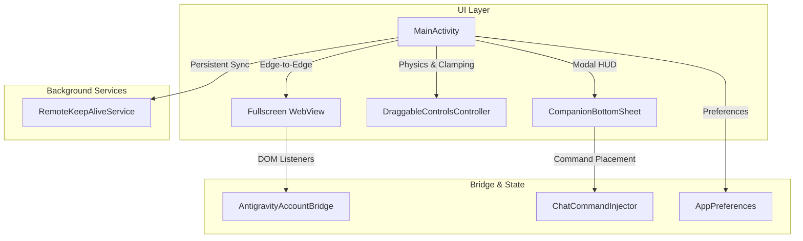

# Antigravity Remote

An open-source Android companion client and remote controller for Google Antigravity web development sessions.

Built with pure AndroidX and Material Components 3, Antigravity Remote provides a native edge-to-edge experience, live session persistence, and instant command injection without any closed-source dependencies or telemetry SDKs.

---

## Features

- **Edge-to-Edge Interface**: Full-screen Android 15/16 experience with dynamic system bar and keyboard insets handling.
- **Companion Controls**: Draggable Material 3 floating pill with quick access to identity switching, remote instance pairing, and hardware health checks.
- **Workstation Onboarding**: Step-by-step guidance to connect your computer running Antigravity.
- **Persistent Session Streaming**: Integrated foreground service (`dataSync`) prevents WebSocket teardown and background process suspension when multitasking.
- **Asset Attachment Bridge**: Integrated file and screenshot picker to upload logs, designs, and test data directly into the remote session.
- **Zero Telemetry and 100% FLOSS**: Contains no Google Play Services blobs, Firebase, Crashlytics, or third-party advertising SDKs. Compatible with F-Droid and IzzyOnDroid.

---

## How to Connect

To pair your mobile device with your development workstation:

1. **Start Remote Session on Workstation**:
   In your computer terminal running Google Antigravity (or in the prompt area), enter:
   ```bash
   /remote
   ```
2. **Copy the Session Link**:
   Copy the generated remote session URL (e.g. `https://antigravity.google.com/r/...` or local tunnel address).
3. **Connect in Antigravity Remote**:
   Open the **Controls** pill in the app, paste the URL into the **Remote link** field, and tap **Connect to remote instance**.

---

## Architecture

The project follows a modular, decoupled architecture:



### Module Breakdown
- `com.sapta.antigravity.remote.MainActivity`: Activity lifecycle orchestrator, window insets, and WebView container.
- `com.sapta.antigravity.remote.ui.controls.DraggableControlsController`: Floating pill physics, drag bounds clamping, and coordinate saving.
- `com.sapta.antigravity.remote.ui.companion.CompanionBottomSheet`: Google Account switcher, onboarding steps, and quick slash commands.
- `com.sapta.antigravity.remote.bridge.AntigravityAccountBridge`: `@JavascriptInterface` bridge with origin verification and SSRF domain protection.
- `com.sapta.antigravity.remote.bridge.ChatCommandInjector`: Shadow DOM prompt target resolution and synthetic input event dispatch.
- `com.sapta.antigravity.remote.data.AppPreferences`: Type-safe configuration and session persistence with zero hardcoded PII.
- `com.sapta.antigravity.remote.RemoteKeepAliveService`: Foreground service with wake lock to preserve WebSocket connections.

---

## Building from Source

### Prerequisites
- JDK 17 (Eclipse Temurin or OpenJDK)
- Android SDK 35 (API 35/36)

### Debug Build
```bash
./gradlew assembleDebug
```
The output APK will be located at:
`app/build/outputs/apk/debug/app-debug.apk`

### Production Release Build (F-Droid Reproducible)
```bash
./gradlew assembleRelease
```
When signing environment variables are not supplied, Gradle automatically generates an unsigned release APK ready for F-Droid server signing:
`app/build/outputs/apk/release/app-release-unsigned.apk`

### Signed Release Build (CI / Local)
Set the following environment variables:
```bash
export KEYSTORE_PATH="/path/to/keystore.jks"
export KEYSTORE_PASSWORD="your_password"
export KEY_ALIAS="your_alias"
export KEY_PASSWORD="your_key_password"

./gradlew assembleRelease
```

---

## License

Antigravity Remote is licensed under the [Apache License, Version 2.0](LICENSE).

---

## Disclaimer

Antigravity Remote is an independent open-source project and is not affiliated with, sponsored by, or endorsed by Google LLC. Google, Google Antigravity, Android, and their respective logos are trademarks of Google LLC.
